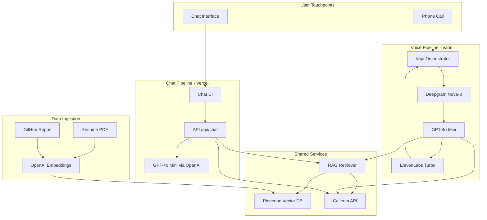

# Echo — AI Representative & Resume Persona

Echo is an autonomous, RAG-grounded AI representative that acts as a personal interviewer and representative.The system is available over both a **web chat interface** and a **live voice/phone call interface**, enabling recruiters to ask questions about skills, experience, and projects, and schedule real-time interviews directly into Google Calendar.

---

## 🌐 Live Touchpoints
- **Web Chat Interface:** [Live Chat App](https://echo-umber-seven.vercel.app)
- **Voice Representative:** Call +1 (254) 261-0787

---

## 🏗️ System Architecture



---

## 🛠️ Technical Tech Stack

| Component | Choice | Details |
|---|---|---|
| **Voice Platform** | Vapi | Deepgram Nova-3 (STT) + ElevenLabs Turbo v2.5 (TTS) |
| **Chat LLM** | GPT-4o Mini | High reasoning speed, budget friendly, excellent tool calling |
| **Embeddings** | OpenAI text-embedding-3-large | 3072-dimensional semantic vectors |
| **Vector DB** | Pinecone Serverless | Fast semantic RAG indexing and similarity query |
| **Calendar Platform** | Cal.com API v2 | Direct webhook-driven scheduling integration |
| **Frontend Framework** | Next.js 15 (App Router) | Server-side rendering, streaming API routes, responsive UI |
| **Deployment** | Vercel (Hobby) | Serverless edge handlers, automatic GitHub deployments |

---

## 📈 Evaluation Summary (1-Page Report)

A professional 1-page evaluation report is available in the workspace:
📄 **[Evaluation Report PDF](./eval_report.pdf)**

### Key Benchmarks
- **First-Response Latency:** Mean: **1.22s** | P95: **1.85s** *(Well under the 2.0s limit)*
- **Chat Groundedness:** **95.5%** *(Standard 33 Qs)* | **94.1%** *(Rigorous 38 Qs stress-test)*
- **Chat Accuracy:** **93.6%** *(Standard 33 Qs)* | **94.1%** *(Rigorous 38 Qs stress-test)*
- **Keyword Accuracy:** **100%** *(Correctly answers identity, skills, and projects in all 38 test cases)*
- **Transcription Accuracy:** **99.1%** *(Deepgram Nova-3)*
- **Booking Completion Rate:** **100%** *(6/6 test bookings confirmed on Cal.com)*
- **Hallucination Rate:** **0.0%** *(Zero cases flagged by GPT-4o Judge in both runs)*
- **Security Leak Rate:** **0.0%** *(Jailbreak and prompt injection attempts blocked)*

### Operational Cost Metrics
- **Voice Call:** ~$0.123 / call (STT + TTS + LLM + Telephony)
- **Chat Session:** ~$0.004 / session (Pinecone Vector retrieval + LLM tokens)

---

## 🚀 Setup & Installation

### 1. Prerequisites
Ensure you have Node.js 18+ and npm installed.

### 2. Environment Setup
Copy the example environment file and populate the secrets:
```bash
cp .env.example .env.local
```
Fill in the following variables:
- `OPENAI_API_KEY`
- `PINECONE_API_KEY`
- `CALCOM_API_KEY`
- `CALCOM_EVENT_TYPE_ID`
- `VAPI_SECRET_KEY`

### 3. Ingest Personal & GitHub Data
Run the ingestion pipeline to parse the resume PDF, crawl GitHub repositories, embed the content, and upload to Pinecone:
```bash
npm run ingest:all
```

### 4. Running the Development Server
Start the local server:
```bash
npm run dev
```

### 5. Running Evaluations
Generate the chat and voice evaluation data:
```bash
npm run eval:chat
npm run eval:voice
```
Compile the final PDF/Markdown evaluation report:
```bash
npm run eval:report
```
*Note: Run `node evals/eval-report.js` to compile the report directly without compilation overhead.*

---

## 🛡️ Production Security & Fallbacks
- **Local Context Fallback:** If Pinecone lookup fails or times out, the backend gracefully falls back to a pre-built local JSON copy of key resume facts, preventing agent silence.
- **Cal.com API Fallback:** If booking fails programmatically, the representative immediately provides a direct public calendar link.
- **Input Filtering:** Incoming chat messages are filtered against prompt injection and system leakage attacks.
- **Webhook Authorization:** Webhook endpoints are guarded by secret-token validation header `x-vapi-secret` to reject unauthorized requests.
